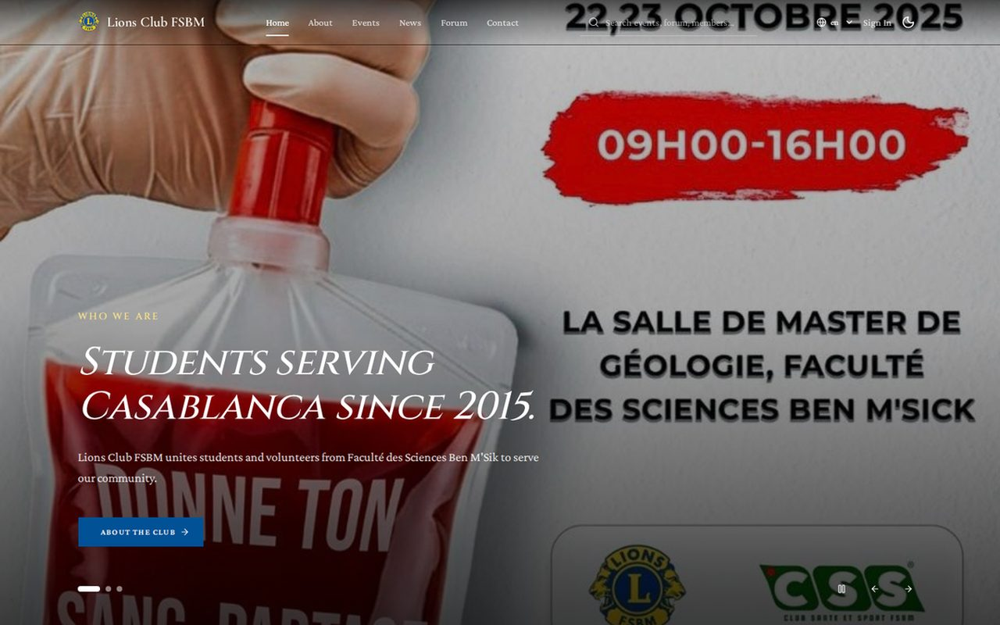

# Lions Club FSBM — Web UI

[](https://github.com/abdelaziz-ebourki/lions-club-ui/actions/workflows/ci.yml)
[](LICENSE)

Single-page application for Lions Club FSBM (Faculté des Sciences Ben M'Sik,
Casablanca). React 19 + TypeScript + Vite, Tailwind v4, shadcn/ui,
react-query, react-router v7, react-hook-form + Zod. Trilingual (EN/FR/AR, RTL).

**Live demo:** [https://lions-club-ui.vercel.app](https://lions-club-ui.vercel.app)
(prototype mode — served with a mocked API, so changes are not persisted).

## Screenshots



## Architecture

```
browser ──► Vercel UI (this repo) ──► REST API ──► PostgreSQL
                 │ mockable (MSW)      Spring Boot 3 + Java 21, cookie-JWT auth
                                       https://github.com/abdelaziz-ebourki/lions-club-api
```

Real-API integration tests live in
[https://github.com/abdelaziz-ebourki/lions-club-e2e](https://github.com/abdelaziz-ebourki/lions-club-e2e)
(full Docker stack + Playwright).

## Prerequisites

- Node.js 22
- The backend running (see the [API quickstart](https://github.com/abdelaziz-ebourki/lions-club-api#quickstart) — one command)

## Development

```bash
npm install
cp .env.example .env   # VITE_API_URL=http://localhost:8081/api
npm run dev            # vite, default http://localhost:5173
```

The dev server proxies nothing: every API call goes to `VITE_API_URL`
(falls back to same-origin `/api`, which is what the Docker image serves
through its nginx `/api` proxy). Auth is cookie-based (`auth_token`,
`SameSite=Lax`), so the browser sends credentials on same-site origins —
no extra CORS setup beyond the API defaults (`:5173`, `:5174` allowed).

## Ports

| What                  | Default               |
| --------------------- | --------------------- |
| Vite dev server       | `5173` (`--port` to change) |
| API (Docker backend)  | `8081`                |
| E2E harness UI (nginx)| `5174`                |
| Mocked UI e2e (`e2e/`) | `5175` (own dev server) |

## Commands

| Command          | Action                                      |
| ---------------- | ------------------------------------------- |
| `npm run dev`    | Start dev server (MSW auto-starts)          |
| `npm run build`  | Type-check (`tsc -b`) + production build    |
| `npm run test`   | Unit tests, watch mode                      |
| `npm run test:run` | Unit tests, single run (CI gate)          |
| `npm run lint`   | ESLint check                                |
| `npx tsc -b`     | Type-check only                             |
| `npx playwright test` | Mocked browser suite in `e2e/` (Chromium) |
| `npm run i18n:check` | Verify locale keys across EN/FR/AR       |

Conventions: tests co-located in `__tests__/`, `@/` path alias, all API
traffic through `api` from `@/lib/api.ts` (never raw `fetch()`), strict
TypeScript (no `any`), Zod v4 for runtime validation. See `docs/`
(`accessibility.md`, `i18n.md`, `qa-report.md`) for quality notes.

## Git hooks

Husky + lint-staged run on commit (lint + type checks on staged files).

## Project structure

```
src/
├── components/   # ui/ (shadcn primitives), shared/, forum/, layout/
├── pages/        # route pages: auth, events, news, forum, gallery, admin/…
├── hooks/        # data + behavior hooks (__tests__/ co-located)
├── contexts/     # AuthContext, ThemeContext
├── lib/          # api client, format, search, seo
├── i18n/locales/ # en|fr|ar namespaces
├── mocks/        # MSW handlers + data for dev/test
└── types/        # shared shapes (Zod-inferred where runtime-checked)
e2e/              # mocked Playwright suite (own vite server on :5175)
```
